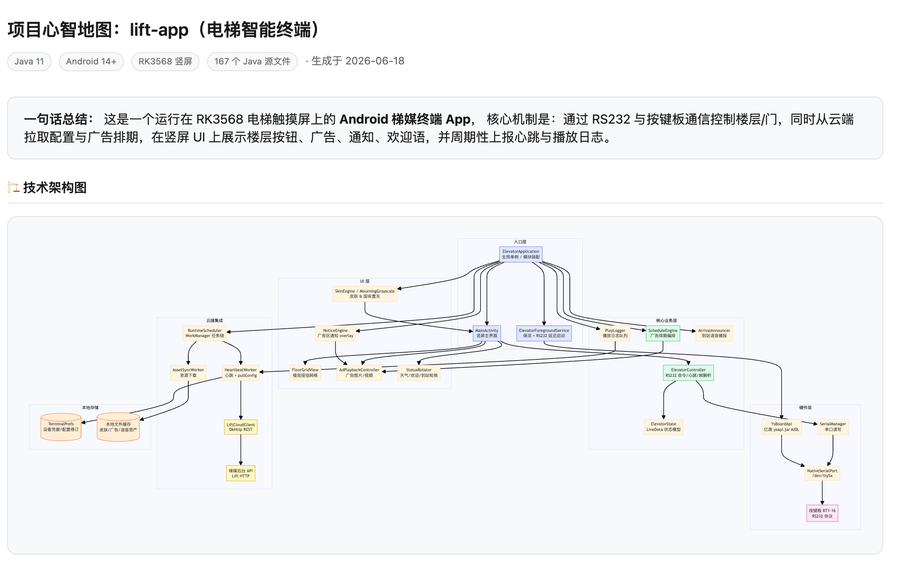
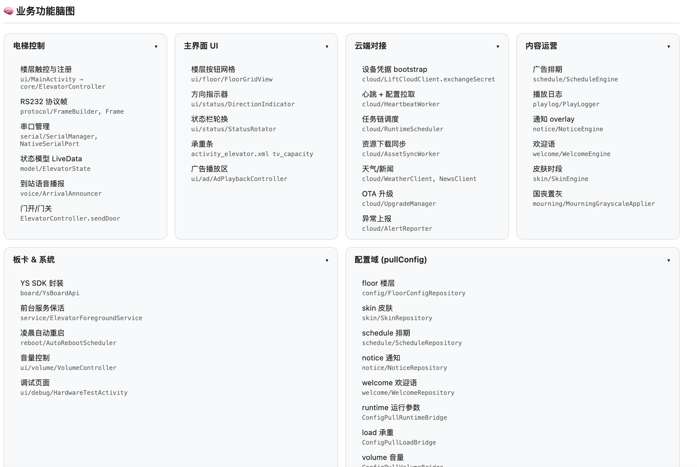
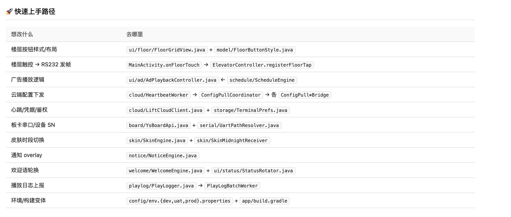
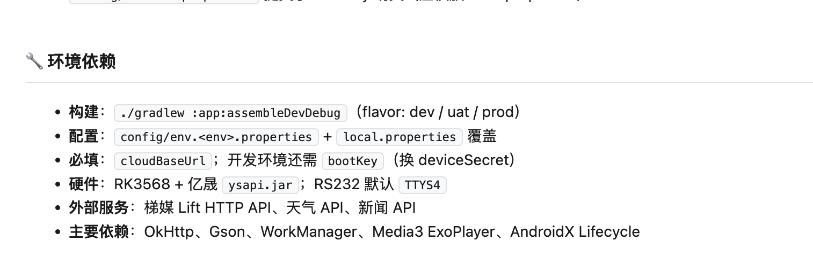

# vibe-code-reader

[](https://skills.sh/DylanMay/vibe-code-reader-skill)

**中文** | [English](#english)

---

## 中文

### 这是什么

一个帮助人类程序员快速读懂 AI 生成代码（vibe coding）的 Claude Skill。

接手别人用 Cursor / Windsurf / Lovable 生成的项目时，往往面对一堆能跑但看不懂的代码——没有注释、没有文档、不知道从哪里下手。这个 skill 会自动扫描项目结构，在 30 分钟内给你输出三样东西：

- 🏗️ **技术架构图** — 入口到数据层的完整调用链路，带颜色分层
- 🧠 **业务功能脑图** — 这个项目在做什么，功能模块怎么划分
- 📋 **项目地图文档** — 关键文件导航、数据流路径、风险清单、环境依赖

### 支持哪些项目类型

| 项目类型 | 支持情况 |
|---------|---------|
| Python 后端（FastAPI / Flask / Django） | ✅ |
| Node.js / TypeScript 后端（Express / NestJS） | ✅ |
| React / Next.js 前端 | ✅（架构图切换为组件树结构） |
| Vue / Nuxt 前端 | ✅ |
| 全栈项目（前后端在一个仓库） | ✅ |
| 微服务（多个子服务） | ✅（每个服务独立分析） |
| 纯代码片段（无完整项目结构） | ✅（简化版分析） |

项目规模自适应：
- **< 30 文件** → 全量精读
- **30–100 文件** → 读入口 + 被引用最多的 Top 10 文件
- **> 100 文件** → 读入口 + 按目录采样

### 可视化输出方式

| 运行环境 | 输出方式 |
|---------|---------|
| Claude.ai | 对话内直接渲染交互式架构图和脑图，节点可点击追问 |
| 其他 LLM / Cursor / API | 生成 `project-map.html`，浏览器直接打开，零依赖 |

### 安装与使用

**方式一：命令行安装（推荐，支持 Cursor / Claude Code / Codex 等）**

```bash
# 安装到当前项目
npx skills add DylanMay/vibe-code-reader-skill -y

# 安装到全局（所有项目可用）
npx skills add DylanMay/vibe-code-reader-skill -g -y

# 仅安装到 Cursor
npx skills add DylanMay/vibe-code-reader-skill -a cursor -y
```

也可在 [skills.sh](https://skills.sh/DylanMay/vibe-code-reader-skill) 查看详情。

**方式二：Claude.ai 网页版**

1. 下载 `vibe-code-reader.skill` 文件
2. 在 Claude.ai 的 Skill 管理页面上传安装

安装后直接对话触发，无需特殊命令。

**触发示例：**

```
帮我理解这个项目的结构
接手了一个 vibe coding 项目，看不懂
给我画一下这个项目的架构图
这个代码库的业务逻辑是什么
```

或者直接把项目压缩包 / 关键文件上传到对话，说"分析一下这个项目"即可。

### 输出示例

分析完成后你会得到：

**技术架构图（交互式）**
```
🚀 main.py → 🔐 Auth Middleware → /api/orders
                                  ↓
                            PaymentService → 💳 Stripe API
                            InventoryService → 🗄️ Redis
```

**风险区域（自动标注）**
```
⚠️ main.py 第8行：SECRET_KEY 硬编码，严重安全隐患
⚠️ order.py#L24：except Exception: pass — 支付失败静默
⚠️ 未发现数据库 migration 文件
```

**快速上手路径**
```
想改支付逻辑 → src/services/payment.py → process_payment()
想加新端点   → src/routes/ 新建文件，在 main.py 注册
```

### AI 代码特征检测

会自动识别并标注 vibe coding 的典型问题：过度防御性 try/except、硬编码魔法数字、重复逻辑分散多处、函数超长、变量命名模糊（`result` / `data` / `temp`）、无意义注释块。








---

## English

### What is this

A Claude Skill that helps human developers quickly understand AI-generated (vibe coding) codebases.

When inheriting a project built with Cursor, Windsurf, or Lovable, you often face code that runs but is hard to read — no comments, no docs, no obvious entry point. This skill scans the project structure and produces three outputs within 30 minutes:

- 🏗️ **Technical architecture diagram** — full call chain from entry point to data layer, color-coded by layer
- 🧠 **Business feature mindmap** — what the project does and how features are organized
- 📋 **Project map document** — key file navigation, data flow, risk checklist, and environment dependencies

### Supported project types

| Project type | Support |
|-------------|---------|
| Python backends (FastAPI / Flask / Django) | ✅ |
| Node.js / TypeScript backends (Express / NestJS) | ✅ |
| React / Next.js frontends | ✅ (diagram switches to component tree) |
| Vue / Nuxt frontends | ✅ |
| Full-stack (frontend + backend in one repo) | ✅ |
| Microservices (multiple sub-services) | ✅ (each service analyzed independently) |
| Code snippets only (no full project structure) | ✅ (simplified analysis) |

Scales automatically by project size:
- **< 30 files** → full read
- **30–100 files** → entry point + Top 10 most-imported files
- **> 100 files** → entry point + directory sampling

### Visualization output

| Environment | Output method |
|------------|--------------|
| Claude.ai | Interactive architecture diagram and mindmap rendered inline in chat; nodes are clickable for follow-up questions |
| Other LLMs / Cursor / API | Generates a `project-map.html` file — open in any browser, no dependencies |

### Installation & usage

**Option 1: CLI install (recommended — Cursor, Claude Code, Codex, and more)**

```bash
# Install to current project
npx skills add DylanMay/vibe-code-reader-skill -y

# Install globally (available in all projects)
npx skills add DylanMay/vibe-code-reader-skill -g -y

# Install to Cursor only
npx skills add DylanMay/vibe-code-reader-skill -a cursor -y
```

See also: [skills.sh/DylanMay/vibe-code-reader-skill](https://skills.sh/DylanMay/vibe-code-reader-skill)

**Option 2: Claude.ai web**

1. Download `vibe-code-reader.skill`
2. Upload it in the Claude.ai Skill management page

Trigger it naturally in conversation — no special commands needed.

**Example prompts:**

```
Help me understand this project's structure
I inherited a vibe coding project and can't figure it out
Draw me an architecture diagram for this codebase
What does the business logic in this repo actually do
```

You can also upload a zip of the project or key files and say "analyze this project."

### Sample output

After analysis you'll receive:

**Architecture diagram (interactive)**
```
🚀 main.py → 🔐 Auth Middleware → /api/orders
                                  ↓
                            PaymentService → 💳 Stripe API
                            InventoryService → 🗄️ Redis
```

**Risk areas (auto-detected)**
```
⚠️ main.py line 8: SECRET_KEY hardcoded — serious security issue
⚠️ order.py#L24: except Exception: pass — payment failures are silent
⚠️ No database migration files found
```

**Quick start paths**
```
To change payment logic → src/services/payment.py → process_payment()
To add a new endpoint   → create file in src/routes/, register in main.py
```

### AI code pattern detection

Automatically identifies and flags common vibe coding issues: excessive defensive try/except, hardcoded magic numbers, duplicated logic scattered across files, oversized functions, vague variable names (`result` / `data` / `temp`), and meaningless comment blocks.

---

## File structure

```
vibe-code-reader/
├── SKILL.md       # Skill instructions (loaded by Claude)
└── README.md      # This file
```

## License

MIT


