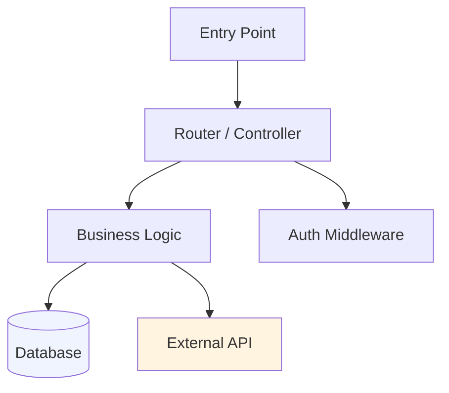

```markdown
---

name: vibe-code-reader

description: |

  专为快速理解 vibe coding 项目设计的代码解读 skill。当用户上传或提供一个由 AI 生成（vibe coding）的项目，想理解项目结构、业务逻辑、技术架构，或接手别人的 AI 生成代码库时，必须使用本 skill。

  触发词包括但不限于：vibe coding 项目、AI 生成的代码、看不懂这个项目、帮我理解这段代码、接手了一个项目、项目架构分析、代码导读、项目地图、技术架构图、业务脑图。

  即使用户没有明说"vibe coding"，只要是让你分析/理解/接手一个现有代码项目，都应触发本 skill。

---

# Vibe Code Reader

帮助人类程序员在 30 分钟内建立对 vibe coding 项目的完整心智模型。输出包括：**项目地图文档 + 技术架构图 + 业务功能脑图**，可视化与文字并重。

---

## 工作流（按顺序执行）

### Step 1：结构扫描

```bash

# 获取目录树（排除 node_modules / .git / dist）

find . -type f \

  | grep -v node_modules | grep -v ".git" | grep -v dist | grep -v ".next" \

  | sort | head -80

# 统计项目规模

find . -type f -name "*.py" -o -name "*.ts" -o -name "*.tsx" -o -name "*.js" \

  | grep -v node_modules \

  | xargs wc -l 2>/dev/null | tail -1

# 查看依赖声明

cat package.json 2>/dev/null || cat requirements.txt 2>/dev/null || cat Cargo.toml 2>/dev/null

```

根据文件数量决定阅读策略：

- **< 30 文件**：全量精读

- **30–100 文件**：读入口 + 读被 import 次数最多的文件（Top 10）

- **> 100 文件**：读入口 + 按目录采样（每个顶层目录读 1–2 个代表文件）

---

### Step 2：入口定位

按优先级查找入口文件：

| 优先级 | 文件名 |

|--------|--------|

| 1 | `main.py` / `app.py` / `server.py` / `index.py` |

| 2 | `index.ts` / `app.ts` / `server.ts` |

| 3 | `index.js` / `app.js` |

| 4 | `package.json` 中的 `main` 或 `scripts.start` 指向的文件 |

| 5 | `README.md` 中提到的启动命令 |

精读入口文件，重点关注：

- 服务启动方式（HTTP / CLI / Worker）

- 路由/端点注册

- 中间件加载顺序

- 环境变量引用`.env` 依赖）

---

### Step 3：核心模块识别

```bash

# 找出被 import 最多的文件（Python）

grep -r "^from \|^import " --include="*.py" . | grep -v node_modules \

  | awk -F: '{print $2}' | sort | uniq -c | sort -rn | head -20

# 找出被 import 最多的文件（JS/TS）

grep -r "^import\|require(" --include="*.ts" --include="*.tsx" --include="*.js" . \

  | grep -v node_modules \

  | awk -F"'" '{print $2}' | sort | uniq -c | sort -rn | head -20

```

对 Top 5 被引用文件做深度阅读，提取：

- 对外暴露的函数/类

- 核心数据结构/类型定义

- 外部依赖（API、数据库、第三方服务）

---

### Step 4：AI 代码特征识别

阅读过程中，标记以下 vibe coding 常见模式：

| 特征 | 含义 | 处理建议 |

|------|------|---------|

| 大段无意义注释块 | AI 补全的解释性注释 | 可删除，看代码本身 |

| 过度 try/except/catch | AI 防御性写法 | 检查是否掩盖了真正错误 |

| 重复逻辑分散多处 | AI 没有抽象意识 | 重构候选 |

| 魔法数字/硬编码字符串 | AI 图方便 | 提取为常量/配置 |

| 函数超过 100 行 | AI 一气呵成 | 切割点标注 |

| 变量名 `result` / `data` / `temp` | AI 懒得命名 | 重命名候选 |

---

### Step 5：生成三份输出

执行完以上分析后，依次生成：

#### 5A：技术架构图（Mermaid）

使用 Mermaid 的 `graph TD` 绘制，展示：

- 入口层 → 路由/控制层 → 业务逻辑层 → 数据层

- 外部依赖（API、DB、第三方服务）用不同颜色节点标注

- 数据流方向用箭头表示



然后**调用 Visualizer**，将 Mermaid 转为交互式 HTML 图表，在对话中直接渲染。

#### 5B：业务功能脑图（Markmap 风格）

用层级 Markdown 列表表示，后转为可视化脑图：

```

[项目名称]

├── 用户功能

│   ├── 认证（登录/注册/JWT）

│   └── 个人设置

├── 核心业务

│   ├── [功能模块A]

│   └── [功能模块B]

├── 数据管理

│   ├── [实体1]

│   └── [实体2]

└── 外部集成

    ├── [第三方服务1]

    └── [第三方服务2]

```

然后**调用 Visualizer**，将脑图渲染为带展开/折叠的交互式 HTML。

#### 5C：项目地图文档

输出完整 Markdown 文档，结构如下（见下方模板）。

---

## 输出模板：项目地图

```markdown

# 项目心智地图：[项目名]

> 生成时间：[时间] | 分析文件数：[N] | 主要语言：[语言]

## 一句话总结

这是一个 **[做什么]** 的 **[项目类型]** 项目，核心机制是 **[关键逻辑]**。

## 快速上手路径

如果你想改 **[功能A]** → 看 `[文件路径]` 的 `[函数名]`  

如果你想改 **[功能B]** → 看 `[文件路径]` 的 `[类名]`

## 关键文件导航

| 文件 | 职责 | 重要程度 |

|------|------|---------|

| `src/app.py` | 服务入口，路由注册 | ⭐⭐⭐ |

| `src/db/models.py` | 数据模型定义 | ⭐⭐⭐ |

| `src/utils/auth.py` | JWT 鉴权逻辑 | ⭐⭐ |

## 数据流主路径

```

用户请求 → [路由] → [鉴权] → [业务逻辑] → [DB 操作] → 响应

```

## ⚠️ 风险区域

- `[文件:行号]` — 硬编码 API Key，应移至环境变量

- `[模块X]` — 无错误处理，失败会静默

- `[函数Y]` — 超过 150 行，逻辑混合，改动风险高

## 🤖 AI 代码特征

- [N] 处发现重复逻辑（重构优先级：高）

- [N] 处硬编码魔法数字

- 整体防御性编码过度（try/catch 滥用）

## 环境依赖

- 需要 `.env` 文件，必填变量`DATABASE_URL`, `API_KEY`

- 外部服务依赖：[列表]

- 数据库：[类型 + 版本]

```

---

## 可视化渲染指南

### 环境检测：优先使用哪种方式？

| 运行环境 | 架构图输出方式 | 脑图输出方式 |

|---------|-------------|------------|

| **[Claude.ai](http://Claude.ai)**（有 show_widget） | 调用 Visualizer 内联渲染 SVG/HTML | 调用 Visualizer 渲染交互脑图 |

| **其他 LLM / Cursor / API**（无渲染能力） | 生成独立 HTML 文件，用浏览器打开 | 同一个 HTML 文件，两图合并 |

**判断规则**：如果当前环境有 `show_widget` 工具可调用 → 用内联渲染。否则 → 生成 HTML 文件输出到 `project-map.html`。

---

### 方式 A：内联渲染（[Claude.ai](http://Claude.ai)）

调用 `show_widget` 渲染 HTML/SVG，在对话中直接展示：

**技术架构图原则：**

- 用纯 SVG 绘制层级图，节点颜色编码：

  - 紫色：入口层

  - 蓝色：路由/控制层

  - 绿色：业务逻辑层

  - 橙色：数据层（DB/Cache）

  - 珊瑚色：鉴权/中间件

- 箭头表示数据流向，节点可点击追问

- 前端项目改为组件树结构（页面 → 组件 → hooks/store → API）

**业务脑图原则：**

- 可折叠分支，按功能域分组

- 叶节点显示对应文件路径

- 底部附风险面板（⚠️ 区域）

---

### 方式 B：HTML 文件输出（其他 LLM / 通用环境）

当没有内联渲染能力时，生成一个完整的 `project-map.html` 文件，包含：

1. **技术架构图**（基于 Mermaid.js CDN，自动渲染）

2. **业务功能脑图**（纯 HTML + CSS，可折叠交互）

3. **项目地图文档**（表格化展示，含风险区域）

**HTML 文件模板结构：**

```html

<!DOCTYPE html>

<html lang="zh-CN">

<head>

  <meta charset="UTF-8">

  <title>项目地图 — [项目名]</title>

  <script src="[https://cdn.jsdelivr.net/npm/mermaid@10/dist/mermaid.min.js"></script>](https://cdn.jsdelivr.net/npm/mermaid@10/dist/mermaid.min.js"></script>)

  <style>

    /* 现代简洁风格，支持亮色/暗色 */

    :root {

      --bg: #ffffff; --surface: #f8f9fa; --border: #e0e0e0;

      --text: #1a1a1a; --muted: #666; --accent: #4f46e5;

      --warn-bg: #fff8e1; --warn-border: #f59e0b; --warn-text: #92400e;

      --risk-bg: #fef2f2; --risk-border: #ef4444;

    }

    @media (prefers-color-scheme: dark) {

      :root {

        --bg: #0f0f0f; --surface: #1a1a1a; --border: #2a2a2a;

        --text: #e5e5e5; --muted: #999; --accent: #818cf8;

        --warn-bg: #1f1a00; --warn-border: #b45309; --warn-text: #fcd34d;

        --risk-bg: #1f0000; --risk-border: #b91c1c;

      }

    }

    body { font-family: -apple-system, BlinkMacSystemFont, 'Segoe UI', sans-serif;

           background: var(--bg); color: var(--text); margin: 0; padding: 24px; }

    h1 { font-size: 22px; font-weight: 600; margin-bottom: 4px; }

    .meta { color: var(--muted); font-size: 13px; margin-bottom: 32px; }

    section { margin-bottom: 40px; }

    h2 { font-size: 16px; font-weight: 600; border-bottom: 1px solid var(--border);

         padding-bottom: 8px; margin-bottom: 16px; }

    /* Mermaid 架构图容器 */

    .arch-box { background: var(--surface); border: 1px solid var(--border);

                border-radius: 12px; padding: 24px; overflow-x: auto; }

    /* 脑图样式 */

    .mindmap { display: flex; flex-wrap: wrap; gap: 12px; }

    .branch { border: 1px solid var(--border); border-radius: 10px;

              min-width: 160px; overflow: hidden; background: var(--surface); }

    .branch-header { padding: 10px 14px; font-size: 13px; font-weight: 600;

                     cursor: pointer; display: flex; justify-content: space-between;

                     align-items: center; user-select: none; }

    .branch-header:hover { background: var(--border); }

    .branch-body { padding: 6px 0; display: none; }

    .[branch.open](http://branch.open) .branch-body { display: block; }

    .leaf { padding: 5px 14px 5px 26px; font-size: 12px; color: var(--muted); }

    .leaf .path { font-size: 10px; font-family: monospace; opacity: 0.6; }

    /* 风险区域 */

    .risk-box { background: var(--risk-bg); border: 1px solid var(--risk-border);

                border-radius: 10px; padding: 16px; }

    .risk-item { font-size: 13px; padding: 4px 0; display: flex; gap: 8px; }

    .risk-item::before { content: "⚠️"; flex-shrink: 0; }

    /* 文件表格 */

    table { width: 100%; border-collapse: collapse; font-size: 13px; }

    th { text-align: left; padding: 8px 12px; background: var(--surface);

         border-bottom: 1px solid var(--border); font-weight: 600; color: var(--muted); }

    td { padding: 8px 12px; border-bottom: 1px solid var(--border); }

    code { background: var(--surface); border: 1px solid var(--border);

           border-radius: 4px; padding: 1px 5px; font-size: 11px; }

  </style>

</head>

<body>

  <h1>项目心智地图：[项目名]</h1>

  <p class="meta">分析文件数：[N] · 主要语言：[语言] · 生成于 [时间]</p>

  <!-- 1. 技术架构图 -->

  <section>

    <h2>🏗️ 技术架构图</h2>

    <div class="arch-box">

      <div class="mermaid">

graph TD

    A["🚀 [main.py](http://main.py)\n入口"] --> B["🔐 Auth Middleware\nJWT 鉴权"]

    B --> C["/api/users\nuser.router"]

    B --> D["/api/orders\norder.router"]

    B --> E["/api/products\nproduct.router"]

    D --> F["PaymentService\nprocess_payment"]

    D --> G["InventoryService\ncheck_stock"]

    F --> H[("PostgreSQL\nOrder/User")]

    F --> I["Stripe API\n支付处理"]

    G --> J["Redis\n库存缓存"]

    style A fill:#e0e7ff,stroke:#4f46e5

    style B fill:#fce7f3,stroke:#db2777

    style H fill:#fef9c3,stroke:#ca8a04

    style I fill:#fef9c3,stroke:#ca8a04

    style J fill:#fef9c3,stroke:#ca8a04

      </div>

    </div>

  </section>

  <!-- 2. 业务功能脑图 -->

  <section>

    <h2>🧠 业务功能脑图</h2>

    <div class="mindmap" id="mindmap"></div>

  </section>

  <!-- 3. 关键文件 -->

  <section>

    <h2>📁 关键文件导航</h2>

    <table>

      <tr><th>文件</th><th>职责</th><th>重要程度</th></tr>

      <!-- 按实际分析结果填充 -->

    </table>

  </section>

  <!-- 4. 风险区域 -->

  <section>

    <h2>⚠️ 风险区域</h2>

    <div class="risk-box" id="risks"></div>

  </section>

  <script>

    mermaid.initialize({ startOnLoad: true, theme: 'base',

      themeVariables: { fontSize: '13px' } });

    // 脑图数据（由 LLM 根据分析结果填充）

    const branches = [/* 填充分析结果 */];

    const risks = [/* 填充风险列表 */];

    const mm = document.getElementById('mindmap');

    branches.forEach(b => {

      const div = document.createElement('div');

      div.className = 'branch open';

      div.innerHTML = `

        <div class="branch-header" onclick="this.parentElement.classList.toggle('open')">

          <span>${b.label}</span><span>▾</span>

        </div>

        <div class="branch-body">

          ${[b.children.map](http://b.children.map)(c => `<div class="leaf">${c.name}<div class="path">${c.path}</div></div>`).join('')}

        </div>`;

      mm.appendChild(div);

    });

    const rb = document.getElementById('risks');

    risks.forEach(r => {

      const d = document.createElement('div');

      d.className = 'risk-item'; d.textContent = r;

      rb.appendChild(d);

    });

  </script>

</body>

</html>

```

生成此文件时，将 `[项目名]`、Mermaid 图内容`branches` 数组`risks` 数组全部替换为实际分析结果，输出为 `project-map.html`，用户双击即可在浏览器查看完整可视化。

---

## 自适应策略

| 场景 | 处理方式 |

|------|---------|

| 只有代码片段，无完整项目 | 跳过 Step 1–3，直接做局部分析，输出简化版地图 |

| 纯前端项目（无后端） | 架构图改为「组件树 + 状态流」结构 |

| 微服务项目 | 每个服务独立分析，加一层服务间通信图 |

| 有 README | 优先读 README 获取作者意图，再与代码比对差异 |

| 无任何文档 | 在输出中标注「意图推断」，区分确定事实与合理猜测 |

---

## 注意事项

1. **不要美化问题** — vibe coding 项目必然有缺陷，如实标注，不要为了好看而隐藏风险

2. **区分事实与推断** — 代码里明确看到的是事实，从命名/结构推断的要标「推断」

3. **优先实用** — 地图的目的是让人能快速开始工作，不是学术报告

4. **中文输出** — 所有分析和文档默认用中文，代码和技术术语保持英文原样
```

